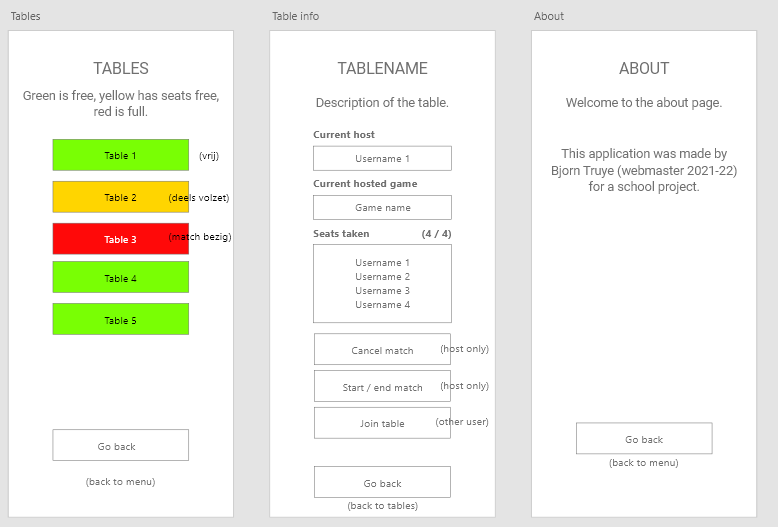

# Persoonlijk project voor Mobile Application Development: Android 
## Info student

- Naam: Bjorn Truye
- Klas: PBA-TIN-TI/G3A2@S1
- Docent: Bosteels Gertjan

## Overzicht huidig traject student
Tijdens de aanvang van dit project volgt de student alle opleidingsonderdelen op die aangeduid zijn in het geel. Merk hierbij op dat <b>DevOps projecten 3</b> nog niet op te nemen was.


## Algemene uitleg project 
Deze Android applicatie zal gebruikt worden voor een atypische studentenclub genaamd <b>'Nemesis'</b> die zich focust op het spelen van boardgames.

Aangezien dit project heel grootschalig is, en bovendien afhankelijk is van een ander opleidingsonderdeel, zullen niet alle elementen van het eindproject geïmplementeerd worden tegen de deadline van 14/01/2022.

Voor de API zal (in de mate van het mogelijke) gewerkt worden met een NodeJS API, geschreven door de student in het opleidingsonderdeel Web Services (MT2 SEM1).

De algemene look and feel is gebaseerd op de bestaande website van de vereniging (https://nemesisgent.be/). 

## Usecases van de Android app

De Android app zal voor veel verschillende zaken kunnen gebruikt worden. Hieronder zijn kort een aantal usecases:

### 1) Lid komt toe in de WEC (Worlds' End Comics & Games Center)
- Opent en meld zich aan op de app
- Wilt zien welke tafels beschikbaar zijn
  - Gaat naar 'Tafels' en ziet a.d.h.v. visuele kleuren direct welke er zijn
- Klikt op een tafel om meer informatie te zien
- Ziet dat zijn vrienden aanwezig zijn en er nog plaats vrij is
- Sluit zich aan bij de tafel

### 2) Lid wilt een spel hosten
- Gaat naar 'Matches'
- Maakt een match aan met 'Create match'
- Vult de info in voor de match o.b.v. de aanwezige tafels en games in de app
- Komt op het scherm terecht met de gekozen tafel en game om te hosten
- Anderen gebruikers zien de tafel 'Geel' worden in het tafeloverzicht want er is één iemand aanwezig aan tafel (de host) en kunnen hierbij aansluiten

### 3) De host start/beëindigd een game
- De gebruiker die een match heeft gecreëerd kan de match starten en beëindigen op het scherm van de tafel, en op het scherm van de matches
- Bij uitvoering gebruik van de app kan gekeken worden wat het duidelijkst is voor de gebruikers (waar de knoppen wel of niet staan) 

### 4) Lid wilt een game bekijken
- Gaat naar 'Matches'
- Maakt een match aan met 'Create match'
- Vult de info in voor de match o.b.v. de aanwezige tafels en games in de app
- Komt op het scherm terecht met de gekozen tafel en game om te hosten
- Anderen gebruikers zien de tafel 'Geel' worden in het tafeloverzicht want er is één iemand aanwezig aan tafel (de host) en kunnen hierbij aansluiten

## Wireframes
Voor de scope van dit project zullen niet alle schermen (fragments) aanwezig zijn die op de wireframe zijn voorzien. Deze wireframes zijn voornamelijk om een overzicht te hebben voor het eindresultaat.

Er zijn geen mockups aanwezig voor dit project. De student heeft reeds ervaring met een Xamarin-project in C#, waaruit bleek dat mockups heel hard kunnen afwijken van de prototypes. Dit bleek een groot tijdverlies te zijn. Aangezien Android Studio volledig nieuw is voor de student werd gekozen om enkel op de Wireframes te focussen. Dit gaf meer creatieve vrijheid in het visueel uitwerken van de GUI.

### Uitleg wireframes

Leden van Nemesis openen de app en komen op een welkom scherm. Afhankelijk van hoe Android Studio integreert met de externe API kunnen leden zich aanmelden/registreren met een nieuw scherm in de applicatie, of een redirect naar de browser (bv. voor Google Accounts). 

Games en tables worden in dit spel volledig van scratch opgebouwd. Het is dus aan de community om deze applicatie verder uit te bouwen. Bepaalde endpoints zullen hierbij specifieke adminrechten nodig hebben (zoals het aanmaken en verwijderen van een tafel).

Eens aangemeld komen de gebruikers terecht op een menu. Vanuit de menu kan de gebruiker doornavigeren naar verschillende hoofdaspecten van de app.

### Terminologie
- <b>Matches</b>: spelers die tegen elkaar / met elkaar een spel spelen 
- <b>Tables</b>: de plaatsen waar een match doorgaat
- <b>Games</b>: de spellen die gespeeld worden in een match


Gebruikers kunnen een overzicht van tafels bekijken, informatie van een tafel zien etc. De about page bevat informatie over de programmeur (en later eventuele GDPR-benodigdheden).



Gebruikers maken in de app zelf games aan om deze te gebruiken in een match.


Gebruikers hosten zelf matches en kunnen een overzicht bekijken van welke match(es) zij aangemaakt hebben. 


<i>Wireframes gemaakt in Adobe XD (zie assets/wireframes_nemesis_app.xd)</i>

## Mogelijke (kleine) uitbreidingen
1) Vrienden maken in de app
2) Vrienden uitnodigen voor een tafel/match
3) Een scherm met veel voorkomende elementen bij boardgames wanneer een match van start gaat (bv. dobbelstenen om te rollen, een random user knop om te bepalen welke speler van start gaat ...)
4) De vereniging heeft een 'kast' van boardgames die ieder jaar door de gamemaster worden bijgehouden. In de app kan een externe API van boardgamegeek opgeroepen worden om de collectie van Nemesis op te halen (zie https://nemesisgent.be/Games) 

## Mogelijke (grote) uitbreidingen
1) Scores van een spel bijhouden (wie heeft gewonnen etc.)
2) Statistieken van spelers bijhouden (aantal games gespeeld, gewonnen ...)

## Bekende bugs en problemen

### 1) Inlezen van mockdata van RapidAPI

Mockdata in Postman ziet er als volgt uit:
```json
{
    "apiGames": {
        "gameName": "Magic Maze",
        "gameSubtype": "boardgame"
    }
}
```

Android Studio geeft volgende error:
```html
com.squareup.moshi.JsonDataException: Required value 'apiGames' (JSON name 'body') missing at $
```

### 2) Inlezen API webservices

De API van dit opleidingsonderdeel heeft nog een aantal bekende bugs zitten waardoor nog niet alle data opgevraagd kan worden. 


